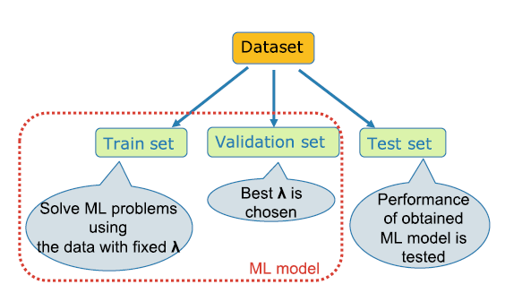

# 1. Introducción

------------------------------------------------------------------------

### Problema de Optimización Binivel

El problema general de optimización binivel se define como:

$$
\DeclareMathOperator*{\argmin}{argmin} % Define el operador argmin
\begin{equation}
\begin{aligned}
& \min_{x} \; F(x, y) \\
& \text{sujeto a } \\
& g_i(x, y)\leq 0,\;i=1,\ldots,q, \\
& y \in \argmin_{y} \left\{ f(x, y) \mid v_j(x, y)\leq 0,\;j=1,\ldots,q \right\}
\end{aligned}
\end{equation}
$$

------------------------------------------------------------------------

-   **Objetivo General**:
    -   Desarrollar un generador de problemas binivel que permita estudiar el comportamiento de algoritmos conocidos.

-   **Objetivos Específicos**:
    -   Garantizar la factibilidad y estacionariedad en puntos dados.
    -   Evaluar el desempeño de algoritmos en problemas modificados.
    -   Analizar resultados experimentales en problemas lineales, cuadráticos y no convexos.

------------------------------------------------------------------------

## Sumario

1.  Marco Teórico
3.  Resultados
4.  Conclusiones
5.  Trabajo Futuro
6.  Oponencia

# 2. Marco Teórico

------------------------------------------------------------------------

## Principales usos de los problemas binivel en la literatura:

-   Mercado Eléctrico (Aussel 2017, Taylor and Francis)
-   Ecoparques industriales (Ramos 2016, Comput. Chem. Eng.)
-   Ajuste de hiperparámetros en entrenamiento de machine learning (Okuno, T 2020, Springer)

------------------------------------------------------------------------

## Los problemas binivel son complejos computacionalmente:

-   *NP-Hard* (Dempe 2020, Springer)
-   *ΣP2-hard* (Cerulli 2021, Hal)

------------------------------------------------------------------------

### Problema de Optimización Binivel

El problema general de optimización binivel se define como: 
$$
\DeclareMathOperator*{\argmin}{argmin} % Define el operador argmin
\begin{equation}
\begin{aligned}
& \min_{x} \; F(x, y) \\
& \text{sujeto a } \\
& g_i(x, y)\leq 0,\;i=1,\ldots,q, \\
& y \in \argmin_{y} \left\{ f(x, y) \mid v_j(x, y)\leq 0,\;j=1,\ldots,q \right\}
\end{aligned}
\end{equation}
$$

------------------------------------------------------------------------

### Transformación KKT

Reemplazando el problema del nivel inferior por sus condiciones KKT, obtenemos:

$$
\begin{aligned}
\min_{x, y, \lambda_j} & \quad F(x, y) \\
\text{s.a.} & \quad g_i(x, y) \leq 0, \quad i = 1, \dots, q, \\
& \quad \nabla_y f(x, y) + \sum_{j=1}^s \nabla_y v_j(x, y) \lambda_j = 0, \\
& \quad v_j(x, y) \leq 0, \quad j = 1, \dots, s, \\
& \quad \lambda_j \geq 0, \quad j = 1, \dots, s, \\
& \quad v_j(x, y) \lambda_j = 0, \quad j = 1, \dots, s.
\end{aligned}
$$

------------------------------------------------------------------------

### Programación Matemática con Restricciones de Equilibrio (**MPEC**)

$$
\begin{equation}
\begin{aligned}
\min  &\quad  f(z)  \\
\text{s.t.} &\quad \begin{matrix} g_i(z)& \leq& 0, &i=1,\ldots,q, \\ h_k(z) &=& 0,&k=1\ldots,m, \\
 G_j(z) &\geq& 0, & j=1,\ldots,s,& H_j(z) &\geq& 0, & j=1,\ldots,s, \end{matrix}
\\&G_j(z)^T H_j(z) = 0,\; j=1,\ldots,s. \\
&\text{Definición de MPEC} \\
\end{aligned}  
%\tag{\theequation} 
\end{equation}
$$

------------------------------------------------------------------------

### Tipos de Puntos Estacionarios

#### Para MPEC

-   **C-Estacionario**:

-   **M-Estacionario**:

-   **Fuertemente Estacionario**:
---
### Condiciones de KKT para el MPEC del problema binivel.

$$
\begin{matrix}
 \nabla_z F(z_{est}) + \sum_{i=1}^q \mu_i\nabla_z g_i(z_{est}) +\sum_{i=1}^{s} \beta_j\nabla v_j(z_{est}) +\\+\sum_{k=1}^{q_0} \alpha_k\nabla_z[  \nabla_{y} f((z_{est}) +\sum_{j=1}^{s} \nabla_{y} v_j((z_{est}) \lambda_j]&=&0\\ j\in J_v^+ \quad \alpha \nabla_{y} v_j(x, y)&=&0\\ j\in (J_v^+)^c\quad
 \alpha  \nabla_{y} v_j(x, y)-\gamma_j&=&0\end{matrix}
$$ 

## Condiciones de complementariedad
---
## Condiciones de factibilidad

#### Para binivel reformulado

-   **C-Estacionario**:

-   **M-Estacionario**:

-   **Fuertemente Estacionario**:

### Valores del Multiplicador alpha

-   $$\alpha=0  $$
-   $$\alpha \neq 0$$
---
# 3. Resultados

------------------------------------------------------------------------

### Ambiente Computacional:

-   Lenguaje de programación:
    1.  **Julia**
-   Bibliotecas:
    1.  Symbolics
    2.  LinearAlgebra
-   Bibliotecas para hallar óptimos:
    1.  BilevelJuMP
    2.  JuMP

------------------------------------------------------------------------

### Generador de problemas Binivel

**Dado**:

-   Problema de optimización binivel
    1.  Conjunto de índices activos.
-   Punto a requerir a ser estacionario.
    1.  Conocer el tipo de estacionariedad requerida.

------------------------------------------------------------------------

### Transformaciones en el nivel inferior:

-   Las restricciones activas ($\alpha \neq 0$) : 
     

$$\hat{v_j}=v_{j}(z_{est})+ ({\vec{b_j}}^T)\cdot (y_1,y_2,\dots,y_m).\left\{\begin{matrix}j\in J_v^+ \quad \alpha \nabla_{y} v_j(x, y)&=&0\\ j\in (J_v^+)^c\quad
     \alpha  \nabla_{y} v_j(x, y)-\gamma_j&=&0
    \end{matrix}  \right.
    
$$

   
-   Garantizar que el punto en $\hat{v_j}$ es factible. 
$$
v_{j}^{\star}(x,y)=v_{j}(x,y)+ ({\vec{b_j}}^T)\cdot (y_1,y_2,\dots,y_m)+c_j^v   \left\{\begin{matrix}j\in J_v^+ \\ j\in J_v^0\\j\in J_l^+
    \end{matrix}  \right.
$$

-   Modificar la función objetivo: 
$$f^{\star}(x,y)=f(x,y)+\vec{bf}y$$
                                 KKT nivel inferior

------------------------------------------------------------------------

### Transformaciones en el nivel superior.

- Garantizar que el punto es factible en $g_{i}$: 
$$
g_{i}^{\star}(x,y)=g_{i}(x,y)+c_i^g
$$

- Modificar la función objetivo: 
$$
F^{\star}(x,y)=F(x,y)+\vec{BF}(x,y)^T
$$

------------------------------------------------------------------------

#### Salida del generador:

La salida del generador son las funciones:

-   $F^{\star}(x,y)$
-   $f^{\star}(x,y)$
-   $g_1^{\star}(x,y),\ldots,g_q^{\star}(x,y)$
-   $v_1^{\star}(x,y),\ldots,v_s^{\star}(x,y)$

------------------------------------------------------------------------

### Experimentar con problemas prueba

1.  Seleccionar 5 problemas de cada tipo:
    -   Lineales
    -   Cuadráticos
    -   No Convexos
2.  Cada problema crear 4 problemas perturbados del tipo:

-   C-Estacionario.
-   M-Estacionario.
-   Fuertemente-Estacionario.
-   $\alpha=0$

------------------------------------------------------------------------

3.  Computar con los algoritmos de Julia los mínimos por cada problemas perturbado:

-   Lineales y Cuadráticos: Se uso BilevelJuMP:
    -   Big-M (100,100) (HiGHS)
    -   ProductMode (Ipopt)
    -   SOS1 (SCIP)
-   No Convexos:
    -   Reformulación KKT en JuMP (Ipopt)

------------------------------------------------------------------------

4.  Comparar los resultados obtenidos:

-   Valor de la función objetivo evaluada en el punto estacionario inicial vs el punto óptimo computado por los métodos anteriores.
-   Velocidad del método
---
# 3. Resultados:

## Problemas cuadráticos:

-   Punto estacionario inicial menos complejo.

-   Similitud entre ProductMode y SOS1.

-   Dificultades de Big-M.

---
# 4. Conclusiones

- Generador de Problemas

- Experimentación preliminar 
    - Problemas no solubles.
    - Similitud entre ProductMode y SOS1.
    - Punto estacionario inicial menos complejo.
    - Dificultad de los algoritmos en los problemas No Convexos.

---
# 5. Recomendaciones

- Ampliar la experimentación:
    - Clases de problemas
    - Métodos de solución

- Perfeccionar interfaz gráfica.
---
# 6. Oponencia

------------------------------------------------------------------------

## ¿En qué zonas considera debe intensificarse la experimentación para arribar a resultados más concluyentes?

------------------------------------------------------------------------

### Aumentar las dimensiones de los problemas.

-   Lineales y Cuadráticos.
    1.  Crear matrices aleatorias.
        1.  Hilbert.
        2.  Rango Completo.
        3.  Semidefinida positiva.

------------------------------------------------------------------------

### Casos particulares de interés como:

---

####   Eco Parques Industriales .

---

####   Mercados eléctricos de "pay-as-bid".

---

#### En modelos de aprendizajes automáticos (Dempe 2020).

::: {style="background-color: white;"}

:::
---

$$
\min_{w_{\lambda}, \lambda} g_{val}(w_{\lambda})
$$

$$
\text{s.t. } w_{\lambda} \in \arg\min_{w \in \mathcal{C}} 
\left\{ g_{tr}(w) + \sum_{i=1}^{r} \lambda_i R_i(w) \right\},
\quad \lambda \geq 0.
$$

------------------------------------------------------------------------

## ¿En qué medida considera se cumplieron los objetivos que se plantea el trabajo?

-   *Objetivo* : desarrollar un generador de problemas que, dado un punto y las funciones que definen un problema de dos niveles, agregarles funciones polinomiales de primer o segundo grado de forma tal que el punto inicial dado sea un punto crítico del problema creado.

## Comente un poco acerca de los resultados obtenidos, su alcance e importancia.

-   Un caso en el vector de multiplicadores asociados al Langragiano $=0$.

-   Puntos críticos no sean aislados.

-   Garantías convergencia de puntos C-Estacionarios.

    -   Algoritmos de suavización
    -   Genera problemas puntos conocidos a los cuales converga

-   

    ## Poner los graficos de los C, M, Fuerte y alpha explicar